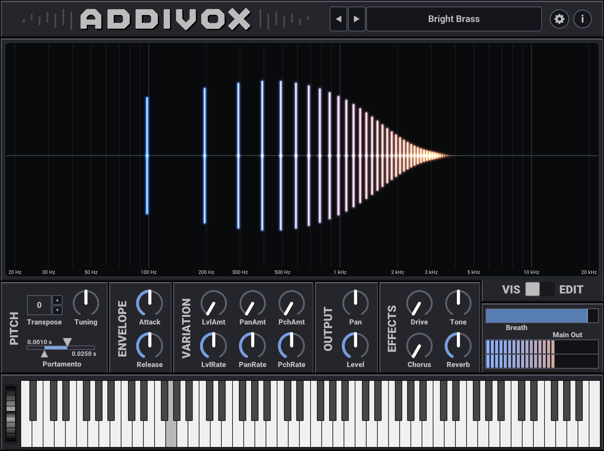

# Introduction

**Addivox** is an additive synthesizer for wind controllers. Key features include:

- Additive synthesis, creating sounds by summing harmonics.
- Monosynth, plays one note at a time.
- Per-harmonic controls over level, breath response, attack, release, pitch, pan and more.
- Designed specifically for wind controllers.
- EQ shaping to create formants.
- Built-in effects.
- Available for macOS and Windows (iOS version coming soon).
- Can run as a standalone instrument or as a plugin in a DAW.
- Built using the [iPlug2](https://iplug2.github.io/) framework.

Check out the [Videos](videos.md) page for some demonstrations and tutorials. You can also download a [Demo version](demo.md) of Addivox to try. If you like it, head over to [Purchasing](purchasing.md) to buy Addivox.

A PDF version of this documentation is available <a href="https://github.com/rrwick/Addivox/releases">here</a>.

The online version of this documentation is available at <a href="https://rrwick.github.io/Addivox/">https://rrwick.github.io/Addivox/</a>.

